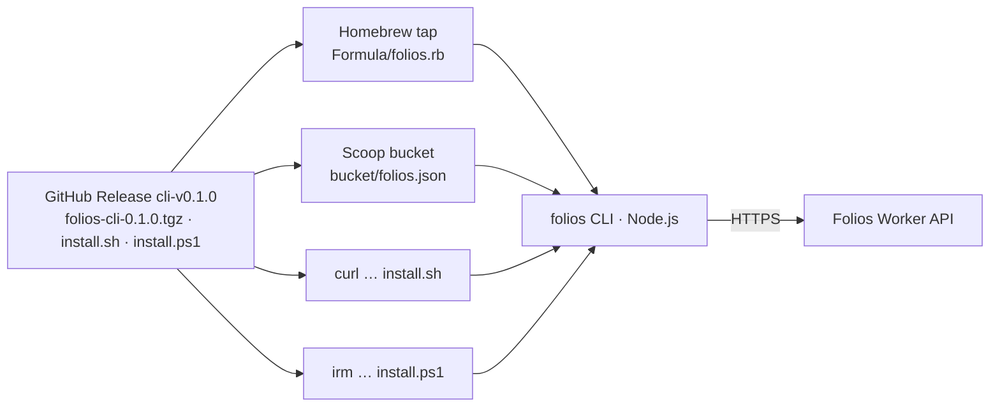

# Folios CLI

Public, anonymous installers for the Folios Works command-line workspace.

[](https://github.com/FriskyDevelopments/folios-cli/releases) 

This repository hosts only the distribution channels: a Homebrew tap (`Formula/folios.rb`), a Scoop bucket (`bucket/folios.json`) and the release assets (tarball, `install.sh`, `install.ps1`, checksums). The CLI is a Node.js program, so Homebrew depends on `node` and Scoop on `nodejs-lts`.



## macOS and Linuxbrew

```bash
brew tap FriskyDevelopments/folios-cli https://github.com/FriskyDevelopments/folios-cli
brew install FriskyDevelopments/folios-cli/folios
```

## Linux and other POSIX systems

```bash
curl -fsSL https://github.com/FriskyDevelopments/folios-cli/releases/download/cli-v0.1.0/install.sh | sh
```

Set `FOLIOS_INSTALL_DIR` to choose a different installation directory.

## Windows PowerShell

```powershell
irm https://github.com/FriskyDevelopments/folios-cli/releases/download/cli-v0.1.0/install.ps1 | iex
```

## Windows Scoop

```powershell
scoop bucket add folios https://github.com/FriskyDevelopments/folios-cli
scoop install folios/folios
```

## Verify

```text
folios --version
folios --json help
```

Release archives and checksums are available on the [releases page](https://github.com/FriskyDevelopments/folios-cli/releases).

The application source remains private. The CLI communicates only with the Folios Worker API; fiscal stamping remains unavailable until its production safety gates are verified.
